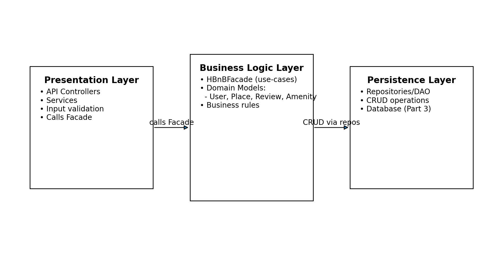
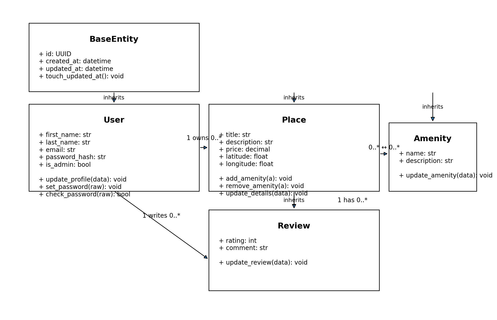
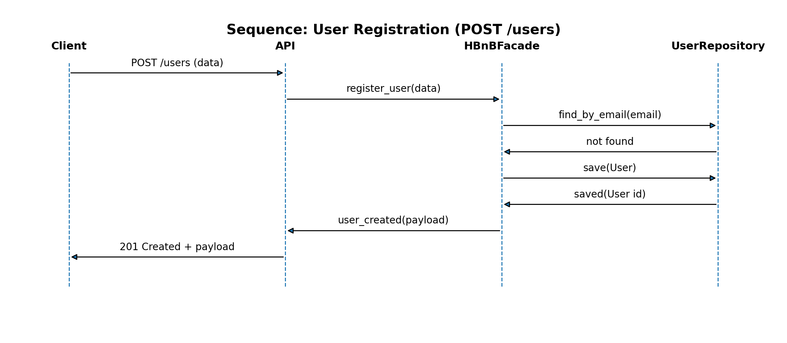
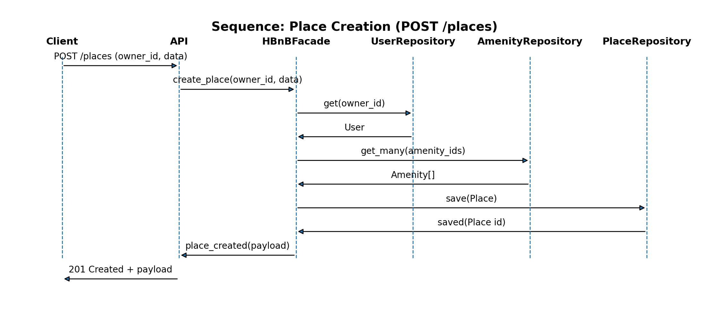
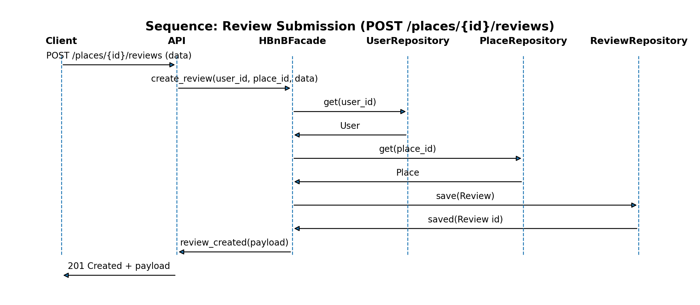
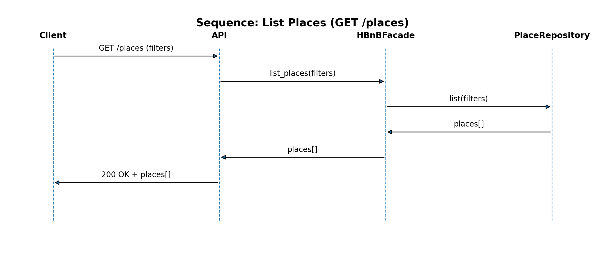

# HBnB Evolution — Part 1: Technical Documentation

This document describes the architecture and design of **HBnB Evolution**, a simplified AirBnB-like application.  
Part 1 focuses on **UML documentation** that will guide implementation in later parts.

---

## 1) Context and Objective

HBnB Evolution supports:
- **User Management**: register, update profile, delete; users may be admins
- **Place Management**: create/update/delete/list places; each place has an owner and amenities
- **Review Management**: create/update/delete/list reviews for places
- **Amenity Management**: create/update/delete/list amenities

All entities:
- have a unique `id`
- track `created_at` and `updated_at`

---

## 2) Architecture Overview (Layered + Facade)

The application uses a **three-layer architecture**:

### Presentation Layer
- Exposes API endpoints (and/or service methods)
- Validates request payloads at a basic level
- Delegates application use-cases to the **Facade**

### Business Logic Layer
- Contains domain models (`User`, `Place`, `Review`, `Amenity`)
- Enforces rules (ownership, relationships, constraints)
- Exposes a simplified API to the presentation layer via `HBnBFacade`

### Persistence Layer
- Provides repositories / DAOs for CRUD operations
- Responsible for storing/retrieving data from the database
- Database specifics are implemented in **Part 3**

---

## 3) High-Level Package Diagram (Facade Communication)

**Goal:** show the three layers and how the **Facade pattern** provides a single entry point from Presentation to Business.

### Notes
- The Presentation layer should not access repositories directly.
- The Facade centralizes use-cases and hides internal complexity.
- Persistence is abstracted behind repositories, enabling DB swaps later.

---

## 4) Business Logic Layer — Detailed Class Diagram

### Goal
Define entities, core fields, and relationships.

### Key Relationships
- A `User` owns many `Place`s (1..*)
- A `Place` has many `Review`s (1..*)
- A `User` writes many `Review`s (1..*)
- `Place` and `Amenity` are many-to-many (*..*)

### Notes / Business Rules Reflected
- Each entity has `id`, `created_at`, `updated_at`.
- `Place.owner` is represented by the `User 1 --> * Place` association.
- `Review` must always be linked to both a `User` and a `Place`.
- `Place <-> Amenity` is many-to-many (often implemented as a join table later).

---

## 5) Sequence Diagrams (API Calls)

The sequence diagrams show the flow between:

**Client → Presentation → Facade (Business) → Repository (Persistence)**

### 5.1 User Registration

### 5.2 Place Creation

### 5.3 Review Submission

### 5.4 Fetch List of Places

### Notes
- The Presentation layer orchestrates HTTP concerns (request/response).
- Domain decisions are centralized in the Facade + domain models.
- Repositories abstract storage and will later map to a real DB schema.

---

## 6) Data Persistence Notes (Part 3 Preview)

Persistence is intentionally abstract in Part 1.  
Later (Part 3), repositories will be implemented with a chosen DB and ORM/queries:

- Entities map to tables
- `Place <-> Amenity` becomes a join table
- Foreign keys: `place.owner_id`, `review.user_id`, `review.place_id`

---

## 7) Summary

This document provides:
- A layered architecture blueprint using a Facade
- Domain models with clear relationships and audit fields
- API interaction flows via sequence diagrams

It serves as the foundation for implementation in later parts of the project.

---

## Authors
- KEDIA IHOGOZA
- SOUMAYA BRAZI

HBnB Evolution — Holberton School